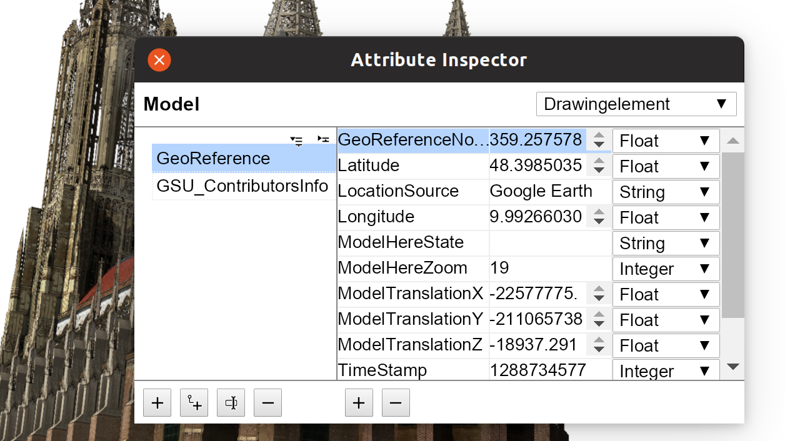

<h1>Attribute Inspector</h1>

<h2>A viewer and editor for SketchUp entity and model attributes</h2>

This is a viewer for entity and model attributes. [Attributes](http://ruby.sketchup.com/Sketchup/AttributeDictionary.html) in SketchUp are additional pieces of information that can be stored with entities like groups, components, scenes. For example one can store a part number, unit price, weight or other annotations with an entity and read or modify that information later. All attributes are included in SketchUp's report feature.

This inspector tries to keep the user interface minimal and very efficient: Just like SketchUp's inspector dialogs, you select one or more entities and it instantly displays their attributes. Your inputs are immediately saved to the entities.

<p align="center"></p>

## Installation

- Go to the [releases page](https://github.com/Aerilius/sketchup-attribute-inspector/releases/) (↑) and download the latest .rbz file. Open in SketchUp _Window → Extension Manager_ and select the .rbz file.

- Alternatively, you can install the contents of the `src` directory into your plugins folder.

  If you choose to run from source rather than use the release `rbz` file, you'll need to run from the `sketchup-attribute-inspector` folder:

  ```shell
  npm install
  npm build
  ```

## Usage

(Menu) `Window → Attribute Inspector`

The dialog shows the attribute dictionaries of the currently selected drawing element. Use SketchUp's selection tool to select another elements.

Click the <kbd>+</kbd>, <kbd>‒</kbd> buttons on the left pane to add or remove an attribute dictionary, and click <kbd>+</kbd>, <kbd>‒</kbd> on the right pane to add or remove an attribute. Since attribute dictionaries are entities, they can themselves have attribute dictionaries. You can also create such nested dictionaries by selecting the parent dictionary in the left pane and clicking the <kbd>└+</kbd> button.

To select other types of entities, choose the type from the dropdown and do:

- **drawing elements**: use SketchUp's selection tool to select one or more drawing elements in the model (edges, faces, groups…)
- **component definitions**: use SketchUp's selection tool to select components/groups/images
- **materials**: use the materials browser and select a material. Attribute Inspector will show the current material (could be not working on OS X due to API bug)
- **layers**: use the layer manager and check the radio button of the layer
- **scenes**: use the scenes manager and double-click the scene (to make it the current scene)
- **styles**: use the styles manager and double-click the style


## Contributing

Bug reports and pull requests are welcome on GitHub at https://github.com/Aerilius/sketchup-attribute-inspector/issues.

## Development

First, run `bundle install` to install requirements.

Run `bundle exec rake test` to run the tests.

To release a new version, update the version number in `version.rb`, and then run `bundle exec rake release`, which will create a git tag for the version and push git commits and tags.

To build a new installation package , run `bundle exec rake build_rbz`.

## License

This extension is available as open source under the terms of the [MIT License](http://opensource.org/licenses/MIT).
